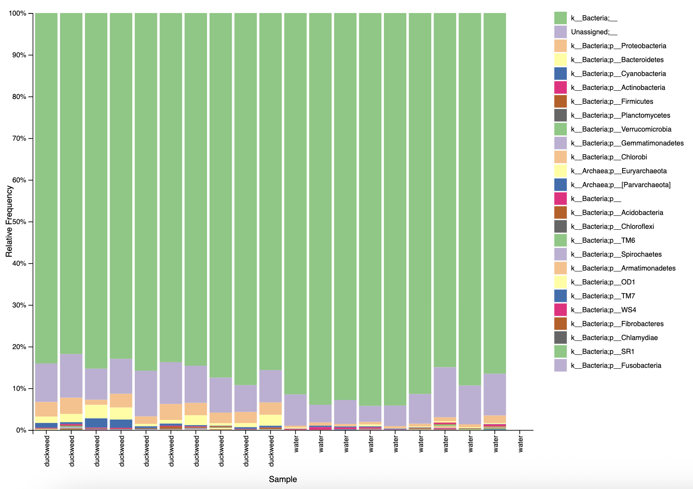
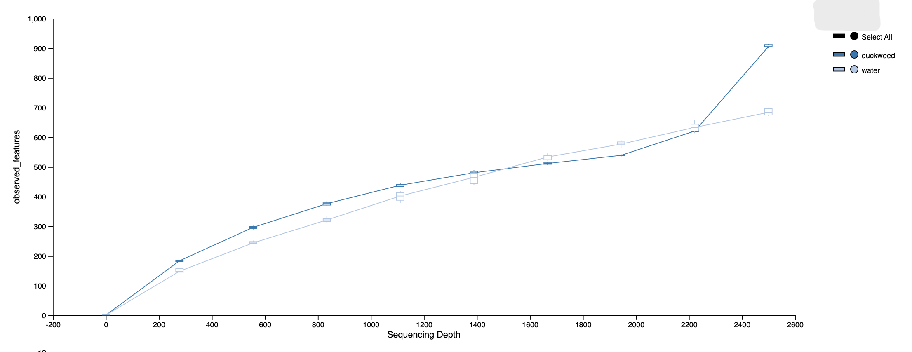

# GEN711 Final Project
## Pond Microbiome Study

### Members 
- Kendell Chase
- Avery Hathaway

---

## Background
16s rRNA sequencing data was borrowed from a graduate student studying the microbiome composition of duckweeds.
The dataset includes:

- 40 paired-end FASTQ files from 20 samples (Illumina HiSeq 2500, 250 bp)
- Two pond sampling locations
- Two treatments:
  - Microbiome from duckweed skimmed off the pond surface
  - Microbiome from pond water
- 5 replicates per treatment
- A metadata file describing the samples
- A manifest file listing the FASTQ locations
  
- **Project Goal:** To analyze and compare the microbial community composition between duckweed and pond water samples.

---

## Methods

### Data Source 
- Provided by a graduate student working on duckweed microbiomes
- Data Type: Paired-end 250 bp reads (FASTQ format)

### Analysis
- Conducted on RON remote cluster with `tmux` and `conda`
- Code was run in the `qiime2-amplicon-2024.5` and `qiime2-amplicon-2024.10` environments

### Tools Used

#### QIIME2
- Used for data import, demultiplexing, denoising with DADA2, taxonomic classification, and diversity analysis
- Imported FASTQ files using a manifest
- Denoised using `qiime dada2 denoise-paired`
- Generated feature table and representative sequences

#### q2-kmerizer + q2-boots
- Used to perform kmer-based diversity analysis (instead of building phylogenetic trees)
- Implemented via `qiime boots kmer-diversity`
- Calculated alpha and beta diversity metrics (e.g., Shannon, Evenness, Bray-Curtis)

#### Alpha Rarefaction
- Used `qiime diversity alpha-rarefaction` to assess species richness over sequencing depth
- Chose max-depth of 2500 based on frequency distribution

#### Taxonomic Composition
- Visualized using `qiime taxa barplot` at phylum level (Level 2)

#### Differential Abundance
- Collapsed feature table to genus level
- Ran ANCOM-BC using `qiime composition ancombc`
- Compared duckweed vs. water samples for significantly enhanced or lacking genera

  
- what did the program do?
        - a paragraph or two at most (for each tool)
- what did that produce?
- what program did you use next?
- write out whole pipeline ...
- how did you visualize your results?

## Findings

**Figure 1. Taxonomic Composition by Sample Type (Phylum Level)**
- Barplot
- Shows dominant phyla across duckweed and pond water microbiomes
- Generated using qiime taxa barplot
- Inputs:
  - `asv-table.qza`
  - `metadata.tsv`
  - `taxonomy.qza`

 

**Figure 2. Alpha Rarefaction Curve (Observed Features)**
- Line Graph
- Shows alpha diversity plotted across sequencing depths
- Created with `qiime diversity alpha-rarefaction`
- Inputs:
  - `alpha-rarefraction.qzv`
- Confirms 2500 as a resonable sampling depth

## Citations
